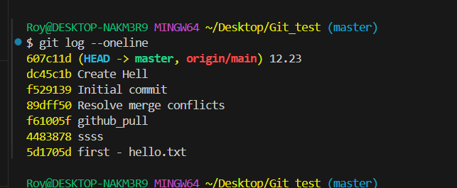

```shell
git remote add origin <name> # 添加远程仓库
git remote rm origin   # 删除远程仓库
git push -u origin master   # 推送本地仓库到远程仓库
git pull origin master   # 从远程仓库拉取最新代码
git pull origin master --allow-unrelated-histories   # 解决合并冲突
git remote update  # 更新远程仓库信息
git checkout -b <name>    # 创建并切换到新分支
git branch -D <name>    # 删除分支
git merge feature-branch   # 合并分支  将名为 feature-branch 的本地分支合并到当前所在的本地分支
git rebase master   # 变基  将当前分支变基到 master 分支
git stash   # 暂存当前工作区的修改
git stash pop   # 恢复暂存区的修改 

git log --oneline   # 查看提交历史
git log --oneline --graph   # 查看提交历史的图形化展示
git reflog   # 查看所有提交历史，包括已经删除的提交记录
git log --oneline --graph --decorate --all   # 查看所有提交历史的图形化展示，包括远程分支

git diff <file>   # 查看文件修改详情
git branch -a   # 查看所有分支
git branch   # 查看当前分支
git branch -r   # 查看远程分支
git commit -a -m "commit message"   # 提交所有修改

git reset --hard <commit-id>   # 回退到指定提交
git reset --soft HEAD^   # 回退到上一个版本
git reset --hard HEAD^   # 回退到上一个版本
git reset --hard origin/master   # 回退到远程仓库的最新版本


git cherry-pick <commit-id>   # 合并指定提交到当前分支
git rebase -i <commit-id>   # 编辑提交历史
git rebase -i HEAD~3   # 编辑最近 3 次提交
git rebase --abort   # 放弃变基操作
git rebase --continue   # 继续变基操作
git rebase --skip   # 跳过当前提交
git rebase --edit-todo   # 编辑变基 todo
git rebase --autosquash   # 自动合并提交
git rebase --onto <newbase> <commit> <commit>   # 变基到指定提交
```


##### 黄色为 commit-id



```shell
VIM  
:q   # 退出编辑器
:wq   # 保存并退出编辑器
:q!   # 强制退出编辑器
:set nu   # 显示行号
:set nonu   # 隐藏行号
:set hlsearch   # 高亮搜索结果
/关键字   # 搜索关键字
n   # 向下搜索
N   # 向上搜索
:s/old/new/g   # 替换当前行

```


```shell
 git init   # 初始化本地仓库
 git remote add origin <name> # 添加远程仓库
 git pull origin master   # 从远程仓库拉取最新代码
 git add .   # 添加所有修改文件到暂存区
 git commit -m "commit message"   # 提交修改到本地仓库
 git commit -am "commit message" || git commit -a-m "commit message"   # 添加并提交所有修改文件到本地仓库
 git push origin master   # 推送本地仓库到远程仓库
 git push -u origin master   # 推送本地仓库到远程仓库并设置默认分支为 master

 git branch -a   # 查看所有分支
 git branch <name>   # 创建分支
 git checkout -b <name>   # 创建并切换到新分支

 git merge <name>   # 合并分支  将名为 <name> 的本地分支合并到当前所在的本地分支
 git rebase <name>   # 变基  将当前分支变基到 <name> 分支

 git branch -d <name>   # 删除分支
 git push origin --delete <name>   # 删除远程分支

 git reset --hard <commit-id>   # 回退到指定提交
 git reset --soft HEAD^   # 回退到上一个版本
 git reset --hard HEAD^   # 回退到上一个版本
 git reset --hard origin/master   # 回退到远程仓库的最新版本

 git reflog   # 查看所有提交历史，包括已经删除的提交记录
```     